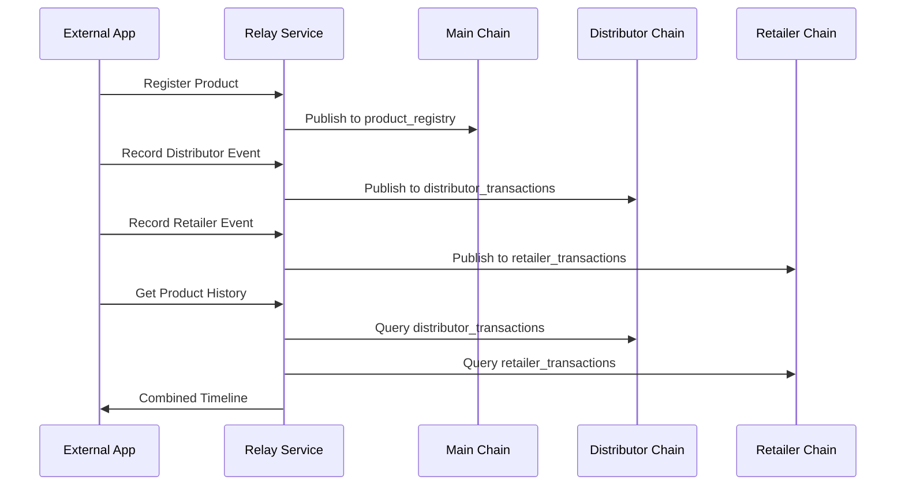
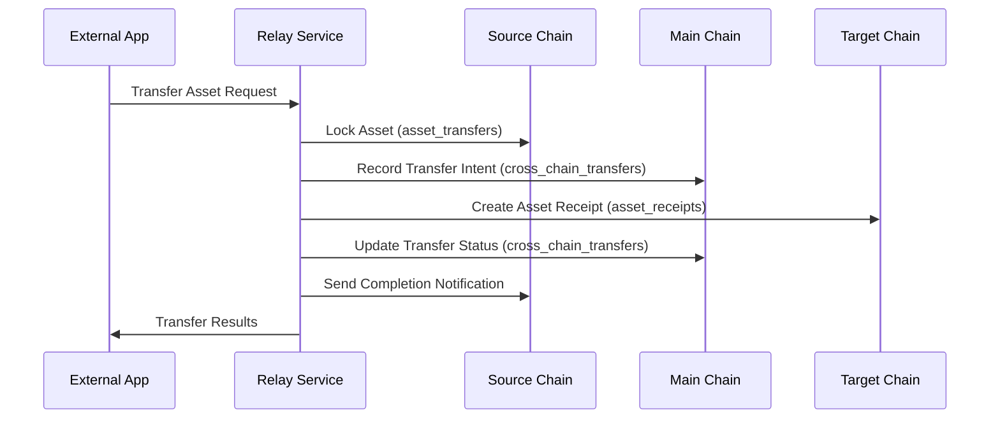
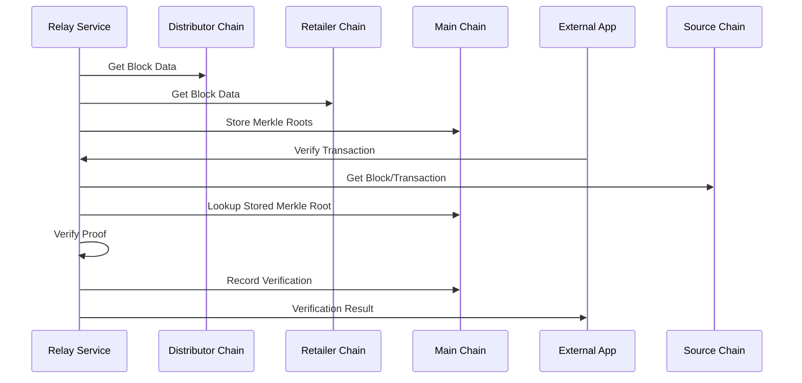

# Distributed Ledger System: Architecture & Flow Documentation

## 1. System Overview

The dist-ledger system is a multi-chain distributed ledger architecture designed for supply chain tracking across different entities. The system consists of:

- **Main Chain**: Central coordination chain
- **Distributor Chain**: Records distributor activities and transactions
- **Retailer Chain**: Records retailer activities and transactions
- **Relay Service**: API layer that manages cross-chain communication

## 2. Chain Architecture

### 2.1 Chain Specifications

| Chain             | RPC Port | Network Port | Purpose                                              |
|-------------------|----------|--------------|------------------------------------------------------|
| Main Chain        | 7744     | 7745         | Cross-chain coordination, product registry, rule management |
| Distributor Chain | 7740     | 7741         | Distributor transactions, shipments, warehouse operations |
| Retailer Chain    | 7742     | 7743         | Retail sales, inventory management, customer interactions |

## 3. Data Flow Processes

### 3.1 Product Registration & Tracking


### 3.2 Cross-Chain Asset Transfer


### 3.3 Merkle Root Verification


## 4. Data Structures

### 4.1 Product Data

```json
{
  "productId": "PROD-123",
  "name": "Product Name",
  "manufacturer": "Manufacturer Name",
  "manufacturingDate": 1615000000,
  "attributes": {
    "color": "red",
    "weight": "2kg"
  },
  "registrationDate": 1740930425771,
  "status": "ACTIVE"
}
```

### 4.2 Transaction Data

- **Distributor Transaction**
```json
{
  "transactionId": "DIST-TXN-1740929011308-4140",
  "transactionType": "SHIPMENT",
  "productId": "PROD-123",
  "quantity": 10,
  "relatedEntity": "RETAILER",
  "timestamp": 1740929011308,
  "status": "PENDING",
  "additionalData": {
    "notes": "Express delivery"
  }
}
```

- **Retailer Transaction**
```json
{
  "transactionId": "RETAIL-TXN-1740929011421-4941",
  "transactionType": "SALE",
  "productId": "PROD-123",
  "quantity": 2,
  "customerId": "CUST-456",
  "storeLocation": "STORE-NYC",
  "timestamp": 1740929011422,
  "status": "PENDING",
  "additionalData": {}
}
```

## 5. API Endpoints

### 5.1 Chain Information

- `GET /api/chain/:chainName/latest-block` - Get latest block information
- `GET /api/network/health` - Network health status
- `GET /api/dashboard/stats` - Dashboard statistics

### 5.2 Product & Supply Chain

- `GET /api/product/:productId/history` - Product transaction history
- `GET /api/supply-chain/product/:productId/history` - Detailed supply chain history
- `POST /api/supply-chain/register-product` - Register new product
- `POST /api/supply-chain/record-event` - Record supply chain event

### 5.3 Transactions

- `POST /api/distributor/transaction` - Record distributor transaction
- `POST /api/retailer/transaction` - Record retailer transaction
- `POST /api/batch/transactions` - Process multiple transactions

### 5.4 Cross-Chain Operations

- `POST /api/transfer/asset` - Transfer asset between chains
- `GET /api/transfer/:transferId/status` - Get transfer status
- `POST /api/relay/merkleroot` - Relay Merkle root to main chain
- `POST /api/relay/verify` - Verify transaction against Merkle root
- `POST /api/sync/merkle-roots` - Synchronize Merkle roots

### 5.5 Rules & Automation

- `POST /api/rules/create` - Create business rule
- `POST /api/rules/process` - Process rules against event
- `POST /api/automation/block-verification` - Manage automated block verification
- `POST /api/admin/setup-streams` - Setup required streams

## 6. Event Flow Example: Product Lifecycle

- **Manufacturing**: Product registered on main chain
- **Distribution**: Product shipped to retailer
- **Retail**: Product sold to customer
- **Verification**: Cross-chain verification
- **Analysis**: Full product history retrieval

## 7. Fault Tolerance & Failover

The system implements multiple levels of fault tolerance:

- **Chain Redundancy**: Each chain has multiple peer nodes
- **Command Failover**: Automatic rerouting of commands to available nodes
- **Data Replication**: Transaction data is replicated across peer nodes
- **Cross-Chain Verification**: Critical data is verified across chains

## 8. Security Measures

- **Merkle Proof Verification**: Cryptographic verification of cross-chain transactions
- **Hash Integrity**: SHA-256 double hashing for data integrity
- **RPC Authentication**: Secure RPC communication between nodes
- **Stream Permissions**: Permission-based access control for data streams

## 9. Deployment Architecture

## 10. System Startup Sequence

1. Start MultiChain nodes: `./scripts/manage.sh start_all`
2. Start Relay Service: `node relay/relay.js`
3. Verify API connectivity: `node test/relay.js`
4. Initialize required streams: `POST /api/admin/setup-streams`
5. Start block verification automation: `POST /api/automation/block-verification`

This comprehensive architecture enables secure, traceable product movement across the entire supply chain, with cryptographic verification and cross-chain coordination through the relay service.